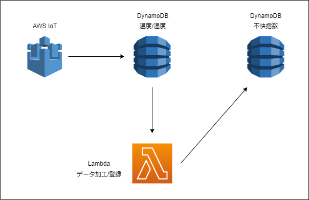
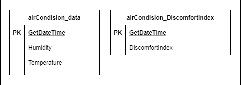

# 温度/湿度から不快指数を計算、DynamoDBへPUTするLambdaファンクション
  
Lambdaを使用したDynamoDBへのデータの読み書きの例。  
DynamoDBへのデータ（温度/湿度）登録をトリガに別テーブルへ不快指数を登録する。  

なお、温湿度のデータ取得等はここでは説明しない。  
Lambdaによるデータ加工、登録処理のみなのであしからず。

登録後のデータはどこかに表示するなりお好きなように。

# Usage

リポジトリの複製後、Lambdaへアップロードのためzipを作成
```bash
$ git clone https://github.com/hoge/~
$ cd airConditionDiscomfortIndexFunc
$ zip airConditionDiscomfortIndexFunc.zip ./lambda_function.py
```
## DynamoDBテーブルの用意
* 任意のテーブルを2つ用意（テーブル名はLambdaの設定と環境変数で設定可。カラムはソースの編集が必要）
    * airCondision_data
    * airCondision_DiscomfortIndex

  

## Lambda関数の作成
* 「関数」>「関数の作成」画面で、以下を指定して「関数の作成」をクリックする。
* 関数名：「airConditionDiscomfortIndexFunc」関数名はzip名とあわせる
    * ランタイム：Python 3.9
    * アーキテクチャ：x86_64
    * アクセス権限>デフォルトの実行ロールの変更：
        * 「基本的な Lambda アクセス権限で新しいロールを作成」を選択
* 「コード」タブ開く
    * 画面右上の「アップロード元」に「.zip」ファイルを選択する。前の手順で作成したzipファイルを指定して、ソースをアップロードする。
    * 「設定」タブ>「アクセス権限」を開く
    * 「実行ロール」に表示されたロール名のリンクをクリック（IAMのロール画面に遷移する）
* 「ポリシーをアタッチします」をクリックして、次のポリシーを追加
    * AmazonDynamoDBFullAccess
## Lambda関数の設定
* 作成したzipをlambdaへアップロードする。
    * 「コード」タブ>「アップロード元」>「.zipファイル」から作成したzipを選択
* 環境変数を設定する
    * 「設定」タブ>「環境変数」で「編集」ボタンを押して以下の環境変数を追加
    * 「table_name」：登録先（airCondision_DiscomfortIndex）テーブルを設定する。
* トリガーを追加
    * DynamoDBを選択
        * DynamoDB テーブルには温度/湿度が入るテーブル（airCondision_data）を選択
    * 追加ボタンをクリック