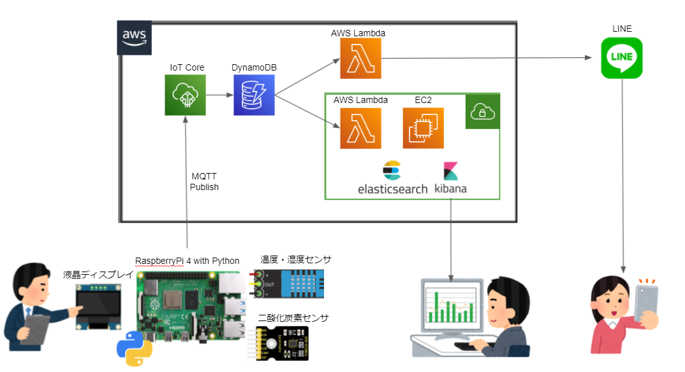

# <span style="color:#ffff00">事前準備 RasPi Wifi設定</span>

## <span style="color:#DD8800; ">（RaspberryPi）Wifi設定の手順 ※既に行っている場合は飛ばしても良い</span>

wpa_supplicantフォルダ配下に【wpa_supplicant.conf】でファイルを作成

その後、ファイル内に以下のように書き込んで設定は完了
``` 
ctrl_interface=DIR=/var/run/wpa_supplicant GROUP=netdev
update_config=1
country=JP

network={
        ssid="1つ目のSSID"
        psk="1つ目のSSIDのパスワード"
        key_mgmt=WPA-PSK
}
```
# <span style="color:#22AAFF">センサで温湿度を計測し、AWSにデータを通知する</span>

## <span style="color:#DD8800; ">（RaspberryPi）温度・湿度センサー環境の作成</span>

最初に、RaspberryPiに作業フォルダを作成する。
``` bash
$ mkdir AirCondition
$ cd AirCondition
```

下図のようにRaspberryPiと温湿度センサ「DHT11」を接続する。

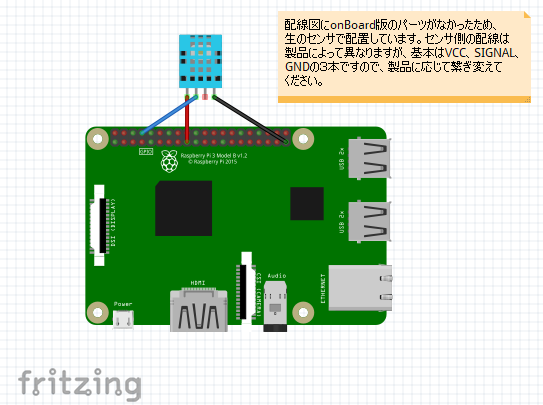

GitHubからDHT11のライブラリを取得する。
``` bash
$ sudo git clone https://github.com/szazo/DHT11_Python.git
```

サンプル起動し、以下のように表示されれば接続はOK。

``` bash
$ sudo python3 ./DHT11_Python/example.py

Last valid input: 2021-11-03 22:44:57.427497
Temperature: 21.0 C
Humidity: 84.0 %
Last valid input: 2021-11-03 22:45:03.511665
Temperature: 22.0 C
Humidity: 73.0 %
：
```

このサンプルソースをベースに、内容を作りこんでいく。

``` bash
# サンプルをコピー 
$ sudo cp ./DHT11_Python/example.py ./aircond.py

# gitファイル削除
$ cd DHT11_Python
$ rm -rf .git

# ライブラリ本体のフォルダをひとつ上に移動
$ cd ..
$ sudo mv -f ./DHT11_Python/dht11/ ./dht11

# 不要フォルダ削除
$ sudo rm -rf ./DHT11_Python
```

## <span style="color:#DD8800; ">（AWS）IoT Coreで「モノ」情報を作成</span>
※注意※　以下の作業からAWSでの作業が関わってくるが、右上の作業領域がデフォルトだと<br>
バージニア北部になっているため、アジアパシフィック(東京)に変更しておくこと。
<br>

以下の手順で、接続してくるRaspberryPiを、仮想の「モノ」として登録する 
- 「サービス」から「AWS IoT Core」を選択。
- 「管理」から「モノ」(Thing)を選択し、「モノを作成」をクリック
- 「１つのモノを作成」を選んで「次へ」
- 「モノの名前」に任意の名前を入力（「air-condition-pi」）して「次へ」
- 「デバイス証明書」で「新しい証明書を自動生成 (推奨)」を選択して「次へ」
- 「証明書にポリシーをアタッチ」で「ポリシーを作成」をクリック。以下の内容を入力して「作成」をクリック。
  - 名前：任意（例：air-condition-pi-policy）
  - アクション：「iot:*」
  - リソースARN：「*」
  - 効果：「許可」をチェック
- ひとつ前の画面（証明書にポリシーをアタッチ）に戻り、作成したポリシーを選択して「モノを作成」をクリック。
- ここで表示される証明書、プライベートキー、パブリックキーをすべてダウンロードする。

また、RaspberryPiが接続するための、IoTエンドポイントを以下の手順で確認する。
- （AWS IoTメニューの）「設定」をクリック
- 「デバイスデータエンドポイント」にある「エンドポイント」をメモする。

## <span style="color:#DD8800; ">（RaspberryPi）MQTT配信機能の作成</span>

前述のサンプル機能に、MQTTへの配信（パブリッシャ）機能を付与して、AWSと通信させる。

最初に、MQTTクライアントのライブラリをインストールする。

``` bash
$ pip3 install paho-mqtt python-etcd
```

サンプルソースを修正して、MQTTへの配信（パブリッシャ）機能を付与する。  
修正後の[ソースはこちら](./aircond2.py)。  
※ソース上の定義部分「# Mqtt Define」の内容は、前述のデバイスデータエンドポイントや、証明書に置き換えてください。

---- 
#### ここでのハマりどころ
- 注意点として、<span style="color:#FF4400">取得した証明書や秘密鍵を作業フォルダにコピーしないこと。</span>  
  `「$ git add .」`でうっかりGitHubにアップされてしまうリスクがある。  
  これらがVSSに上がると、GitHubとAWSの双方からセキュリティリスクの通知メールと、  
  アカウント停止警告メールが来ることになり、対応が大変。
----
<br>

## <span style="color:#DD8800; ">（AWS）IoT Coreで計測した温湿度データを受け取る</span>

以下の手順でRaspberryPiから配信された温湿度データを受信（サブスクライブ）する。
- 「サービス」から「AWS IoT Core」を選択。
- 「テスト」>「MQTTテストクライアント」を選択する。
- 「トピックをサブスクライブする」の「トピックのフィルター」に「topicAirCondition」と入力して、「サブスクライブ」を押す。
- 画面に、一定周期で以下のように表示されれば、受信OK。
``` bash
topicAirCondition
November 01, 2021, 22:23:12 (UTC+0900)
{
  "GetDateTime": "2021-11-01 22:23:09",
  "Temperature": 19.8,
  "Humidity": 70
}
：
```

## <span style="color:#DD8800; ">（AWS）受信したデータをDynamoDBに登録する

以下の手順でIoT Coreが受信したセンサデータを、DynamoDBに登録する。
- 「サービス」から「AWS IoT Core」を選択。
- 「ACT」>「ルール」を指定して、以下の流れでルールを追加する。
  - ルール名は任意（「air_condition_entry_rule」）
  - ルールクエリステートメントに、以下の内容を設定。  
    `「SELECT GetDateTime,Temperature,Humidity FROM 'topicAirCondition'」`
  - アクションに「DynamoDBテーブル（DynamoDBv2）の複数列にメッセージを分割する。」を選択。
  - 新しいリソースとして、DynamoDBに任意のテーブルを作成する。
    - テーブル名の名称は任意（「air-condition-data」）
    - パーティションキーは「GetDateTime」とする
    - 「テーブルの作成」ボタンをクリックする。
  - ロールの作成は任意。<span style="color:#FF4400;">「DynamoDB:PutItem」ポリシーを持つロールが必要</span>となる。

DynamoDBサービスで、「テーブル」>「項目の表示」をクリックして、センサから受信したデータが登録されていることを確認する。


----
#### ここでのハマりどころ
- 「ルールクエリステートメント」欄には、初期表示で、サンプルとして`「SELECT * FROM 'iot/topic'」`と書かれている。  
  このサンプルでは、トピック名が（iot/を含む）「iot/topic」ということに注意。  
  パブリッシャ（RaspberryPi）側でトピック名に「iot/」を含めなかった場合は、ここも「~ FROM 'topicAirCondition'」というように、「iot/」は含める必要はない。
- DynamoDBにデータが登録されない場合は、以下の点をチェックすること。
  - （AWS IoT Coreメニューの）「テスト」>「MQTTテストクライアント」を開き、トピックにクエリステートメントのFROM句に書いた内容を入れ、データがサブスクライブ（受信）できること。
  - 「ルール」を編集し、「エラーアクション」としてエラー結果をS3に格納するようにアクションを追加して、再度RaspberryPiからの受信を受ける。S3にログが格納されればその内容を基に対応を行う。
----
<br>

# <span style="color:#22AAFF">DynamoDBへの登録をトリガして、Lineに通知を出す</span>

## <span style="color:#DD8800; ">（LINE Developers）LINEに通知先のチャネルを登録する
[LINE Developers](https://developers.line.biz/ja/)にアクセスし、以下の手順でチャネルを作成する。
- 画面右上から、LINEアカウントでログインする。
- 画面右下で「日本語」を選択。
- メニュー「プロバイダ」>「作成」ボタンをクリック
  - 「プロバイダ名」に任意の名前を設定（「airCondition」）
  - 「Message API」を選択
  - 必須項目を登録して、「作成」ボタンをクリック（内容は任意）
    - チャネル名「お部屋の空調さん」
    - チャネル説明「お部屋の状態をお知らせします。」
    - 大業種「電気・ガス・エネルギー」
    - 小業種「ガス」
- 作成したプロバイダを選択する。Messaging API設定タブを選択する。
  - 表示されるQRコードを、スマホカメラで読み取ると、スマホのLINEに通知チャネルが登録される。
  - 一番下にある「チャネルアクセストークン」をコピーして、控える（通知先として、この後のlambda
に必要）
- Visual Studio Codeを起動して、LINEからピンポンがくるか、動作テスト。
``` json
POST https://api.line.me/v2/bot/message/broadcast
Authorization: Bearer [チャネルアクセストークン]
Content-Type : application/json 

{
    "messages": [
        {
            "type": "text",
            "text": "Hello World!"
        }
    ]
}
```


## <span style="color:#DD8800; ">（RaspberryPi）AWS Lambda用のファンクションを作成する

作業用のフォルダを作成する。
``` bash
$ mkdir aws_lambda
$ cd aws_lambda

$ mkdir airConditionNotifyLineFunc
$ cd airConditionNotifyLineFunc
```
直下に、pythonソースファイル [lambda_function.py](./aws_lambda/airConditionNotifyLineFunc/lambda_function.py) を作成する。  
※ソースコード中の "access_token" は、後ほどlambda上で環境変数として設定する。

このソースファイルに必要なライブラリ「requests」を、カレントディレクトリ上にインストールする。
``` bash
$ pip install requests -t ./
```

ソース＋ライブラリをlambdaへのアップロード用にzip圧縮する。
``` bash
# カレントディレクトリにlambda_function.pyと各種ライブラリがあることを確認
$ ls 
  bin                                 idna-3.3.dist-info
  certifi                             lambda_function.py
  certifi-2021.10.8.dist-info         requests
  charset_normalizer                  requests-2.26.0.dist-info
  charset_normalizer-2.0.7.dist-info  urllib3
  idna                                urllib3-1.26.7.dist-info

$ zip -r airConditionNotifyLineFunc.zip ./*
```

## <span style="color:#DD8800; ">（AWS）LINE通知用のLambda関数を作成する

以下の手順でlambda関数を作成する
- 「サービス」から「Lambda」を選択。
- 「関数」>「関数の作成」画面で、以下を指定して「関数の作成」をクリックする。
  - 関数名：「airConditionNotifyLineFunc」。名称自体は任意だが、前の手順でzip作成した際の、フォルダ名とあわせる
  - ランタイム：Python 3.9
  - アーキテクチャ：x86_64
  - アクセス権限>デフォルトの実行ロールの変更：
    - 「基本的な Lambda アクセス権限で新しいロールを作成」を選択
- 「コード」タブ開く
  - 画面右上の「アップロード元」に「.zip」ファイルを選択する。前の手順で作成したzipファイルを指定して、ソースをアップロードする。
- 「設定」タブ>「アクセス権限」を開く
  - 「実行ロール」に表示されたロール名のリンクをクリック（IAMのロール画面に遷移する）
  - 「ポリシーをアタッチします」をクリックして、次のポリシーを追加
    - `AmazonDynamoDBFullAccess`
- 「設定」タブ>「環境変数」で「編集」ボタンを押して以下の環境変数を追加
  - 「access_token」：LINE Developers画面で控えた、チャネルアクセストークンを設定する。

動作確認。
- 「コード」タブ>「テスト」で、「テスト」ボタンに以下の内容を登録して、テスト実行する。
``` json 
{
    "Records": [
        {
            "dynamodb": {
                "NewImage": {
                    "GetDateTime": {
                        "S": "2021-11-03 16:20:18"
                    },
                    "Temperature": {
                        "N": "20.5"
                    },
                    "Humidity": {
                        "N": "72.3"
                    }
                }
            }
        }
    ]
}
```
実行して、LINEからピンポンがくるか、テストを行う 

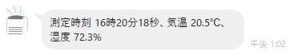

<br>

正常にLINEへの通知が来ることを確認できたら、以下の手順でDynamoDBテーブルの変更通知とつなげる。

- 「設定」タブ>「トリガー」で「トリガーを追加」ボタンをクリック
  - 「トリガーの設定」で「DynamoDB」を選択。
    - DynamoDBテーブル：「air-condition」
    - トリガーの有効化：チェック

<br>

トリガーが設定されると、上のLINE通知が1分に1回通知されてくるようになる。

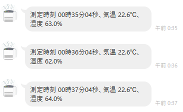

----
#### ここでのハマりどころ
- zip圧縮は、親フォルダを含めず、フォルダの内容だけを圧縮すること。
- 実行Pythonのソースファイル名は「lambda_function.py」とすること。これ以外に変更する場合は、（試していないが）ランタイム設定にあるハンドラ名を変更する必要がありそう。
- lambdaのevent引数に渡されてくるデータ構造がわらかなかった。これは、[こちらのドキュメント](https://docs.aws.amazon.com/ja_jp/lambda/latest/dg/with-ddb.html)か、テストデータ作成画面で表示されるテンプレートを参考にするとよい。
- lambdaが正しく機能しているかは、Cloud Watchログから確認する。ステータスコードが200ではなく429が返っているようであれば、これ ↓ が原因。
- <u><b>LINEへの通知リクエストが多発しないよう注意。</b></u>
  - [レート制限](https://developers.line.biz/ja/reference/messaging-api/#rate-limits)：60リクエスト/時
  
  - [その月の配信可能なメッセージ数の上限](https://www.linebiz.com/jp/manual/OfficialAccountManager/account-settings/)：フリープラン 1,000通/月

  - [開発ガイドライン](https://developers.line.biz/ja/docs/messaging-api/development-guidelines/)：「いかなる目的でも、同一ユーザーへメッセージを大量送信しないでください。」  

  基本的に多くても1分に1回を上限とするのがよさそう。上記いずれかに抵触すると、HTTPステータスコード「429」応答が返るようになる。そうでなくても、開発ガイドラインの記載違反なので、いつBANされるか…。
----
<br>

# <span style="color:#22AAFF">ElasticSearch+Kibanaでセンサーデータをグラフに可視化する</span>

## <span style="color:#DD8800; ">（AWS）VPCネットワークとEC2環境を構築する

独立したVPN一つと、publicサブネットを一つ作成し、上にEC2を構築する。  

  |種別|名前|IPアドレス|  
  |--|--|--|  
  |VPC|biweb-dev-vpc|10.0.0.0/16|  
  |サブネット|biweb-dev-pub-subnet1|10.0.16.0/20|  
  |EC2|biweb-dev-web|10.0.20.any|  

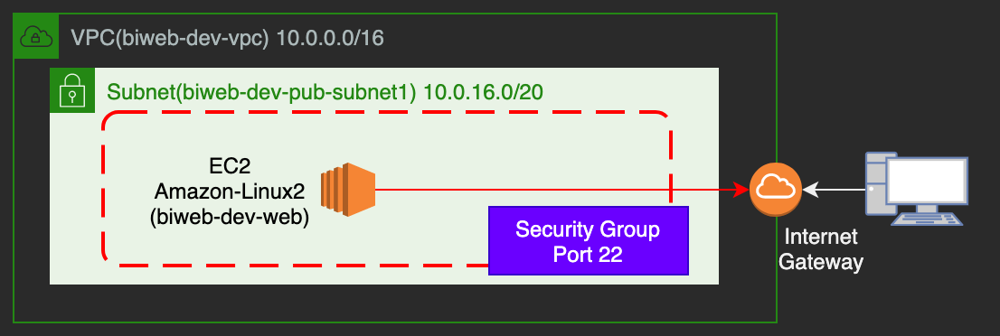

- なお、/16は先頭16ビットまでがサブネットマスクであることを示している（CIDR形式と呼ぶ）
- EC2を作成する前に、サブネットの「自動割当IP設定」を有効化する。

- EC2作成時、セキュリティグループには、SSHアクセスだけを許可とする。Sourceは「マイIP」をクリックして自宅のIPからの要求だけ許可とする
- EC2作成後、アクセス用のキーペアをダウンロードして保存しておく。
- EC2作成後、パブリックIPv4アドレスが割当されていることを確認する。

<br>
自PCからのSSHアクセス
- VPCメニューから、インターネットゲートウェイを作成（biweb-dev-igw）して、サブネット（biweb-dev-pub-subnet1）にアタッチする。

- VPCメニューから、サブネットを選択し、作成したサブネットのルートテーブルに以下を加える。 

  |送信先|ターゲット|
  |--|--|
  |0.0.0.0/0|（作成したIGW）|

- ローカルPCで「Tera Term」を起動して、「Host」に作成したEC2のパブリックIPv4アドレスを指定する。  
  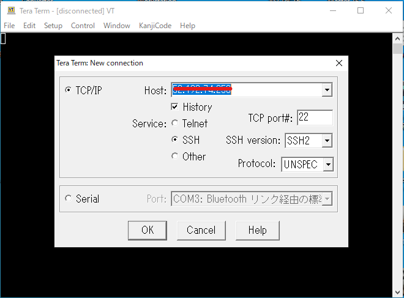

- OK押下後の認証画面で、以下の内容を設定してOKをクリック。
   - 「User name」に「ec2-user」（これは固定値）
   - 「Use RSA/~(略)～ key to log in [Private key file:]」に、ダウンロードしたキーを選択  
  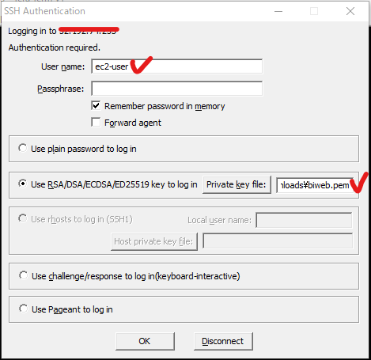

- 以下のとおり、ログインが成功すれば、準備OK。

  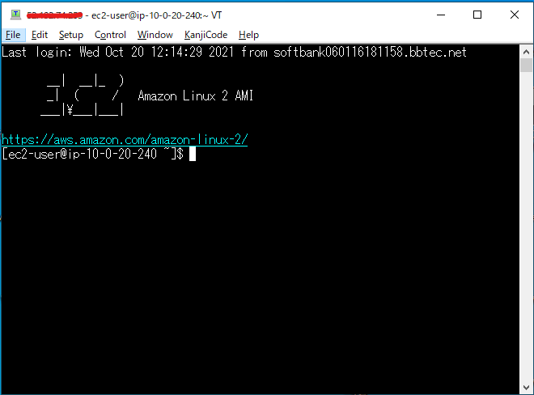

なお、Amazon Linux2 EC2は、システム時間がGMTとなっており、日本時間と9時間のずれがある。  
[ここ](https://docs.aws.amazon.com/ja_jp/AWSEC2/latest/UserGuide/set-time.html#change_time_zone)を参考に、システム時間を日本標準時に設定する。

その後、必要最低限のソフトをインストールして環境を準備する

``` bash
# yumリポジトリ更新
$ sudo yum update -y

# java8 OpenJDK
$ sudo yum install java-1.8.0-openjdk.x86_64
```

## <span style="color:#DD8800; ">（AWS）EC2にElasticSearchをセットアップする

[公式サイト](https://www.elastic.co/guide/en/elasticsearch/reference/current/rpm.html)を参照しつつ、RPMを使用してインストールを行う。

GPG-KEYをローカルリポジトリにインポートする  　※GPGの説明は[こちら](https://qiita.com/y518gaku/items/435838097c700bbe6d1b#gpg%E3%81%A8%E3%81%AF)を参照
```
$ sudo rpm --import https://artifacts.elastic.co/GPG-KEY-elasticsearch
```

ElasticSearch RPMのrepoを所定フォルダに生成する
``` bash
$ sudo nano /etc/yum.repos.d/elasticsearch.repo
```

elasticsearch.repo への記載内容は以下の通り。
``` bash
[elasticsearch]
name=Elasticsearch repository for 7.x packages
baseurl=https://artifacts.elastic.co/packages/7.x/yum
gpgcheck=1
gpgkey=https://artifacts.elastic.co/GPG-KEY-elasticsearch
enabled=0
autorefresh=1
type=rpm-md
```

インストールコマンドを実行する
``` bash
$ sudo yum install --enablerepo=elasticsearch elasticsearch
：
：
Installed:
  elasticsearch.x86_64 0:7.15.1-1

Complete!
```

外部アドレスからのアクセスを可能にするため、設定ファイル「elasticsearch.yml」を開く。
```
$ sudo nano /etc/elasticsearch/elasticsearch.yml  
```

以下の箇所に追記を修正して、ファイルを保存。
```
# By default Elasticsearch is only accessible on localhost. Set a different
# address here to expose this node on the network:
#
#network.host: 192.168.0.1
network.host: 0.0.0.0   # ←ここを追記
discovery.type: single-node # ←ここを追記
```

また、同じファイルに対して最後の行に次の内容を設定しておく。
```
xpack.security.enabled: false  # ←ここを追記
```
上の意図は「セキュリティ機能を使用しない」というもの。  
今回はあえて使用しない。このように明示的に設定しないと、Kibana操作時に警告が多発する

↓ 警告表示の例（うざい）  

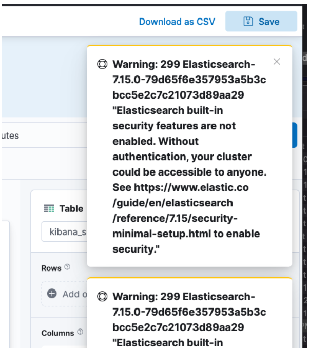


システム起動時にElasticSearchを起動するようにする（systemd）
``` bash
$ sudo /bin/systemctl daemon-reload
$ sudo /bin/systemctl enable elasticsearch.service

$ # （ちなみに、システムを 起動をやめさせたい場合は次のとおり）
$ sudo /bin/systemctl disable elasticsearch.service

```

以下、動作確認。まずはPCを再起動。
``` bash
$ sudo shutdown -r now
```

再起動後、起動状態をチェックする

``` bash
$ sudo systemctl | grep elastic
elasticsearch.service         loaded active running   Elasticsearch
```

以下のコマンドでサービス自体の起動を確認（デフォルトポートは 9200）
``` bash
$ sudo curl http://localhost:9200
{
  "name" : "ip-10-0-23-98.ap-northeast-1.compute.internal",
  "cluster_name" : "elasticsearch",
  "cluster_uuid" : "9RtovLuBTuyvlNjuMLLekg",
  "version" : {
    "number" : "7.15.1",
    "build_flavor" : "default",
    "build_type" : "rpm",
    "build_hash" : "83c34f456ae29d60e94d886e455e6a3409bba9ed",
    "build_date" : "2021-10-07T21:56:19.031608185Z",
    "build_snapshot" : false,
    "lucene_version" : "8.9.0",
    "minimum_wire_compatibility_version" : "6.8.0",
    "minimum_index_compatibility_version" : "6.0.0-beta1"
  },
  "tagline" : "You Know, for Search"
}
```

同様に外部からのアクセスを確認。最初にAWSのセキュリティグループで、ポート9200を許可設定する。

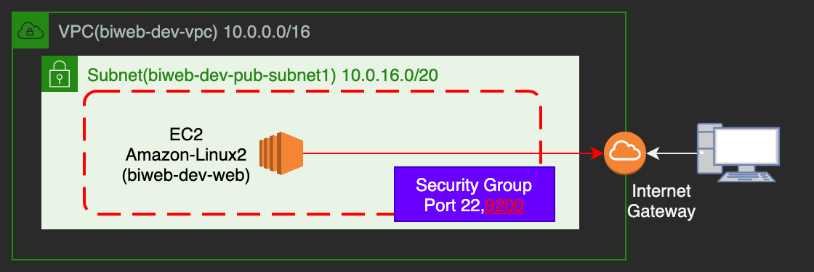

ブラウザで「http://[ip address]:9200/」にアクセスし、上と同じ表示がされればOK。

## <span style="color:#DD8800; ">（AWS）EC2にKibanaをセットアップする

Kibana RPMのrepoを所定フォルダに生成する
``` bash
$ sudo nano /etc/yum.repos.d/kibana.repo
```

kibana.repo への記載内容は以下の通り。
``` bash
[kibana-7.x]
name=Kibana repository for 7.x packages
baseurl=https://artifacts.elastic.co/packages/7.x/yum
gpgcheck=1
gpgkey=https://artifacts.elastic.co/GPG-KEY-elasticsearch
enabled=1
autorefresh=1
type=rpm-md
```

インストールコマンドを実行する
``` bash
$ sudo yum install kibana 
：
：
Installed:
  kibana.x86_64 0:7.15.1-1

Complete!
```

外部アドレスからのアクセスを可能にするために、設定ファイル「kibana.yml」を開く。
```
$ sudo nano /etc/kibana/kibana.yml
```

以下の箇所に追記を行って、ファイルを保存。
``` bash
# To allow connections from remote users, set this parameter to a non-loopback $
# server.host: "localhost"
server.host: "0.0.0.0"   # ← ここを追記
```

システム起動時にKibanaを起動するようにする（systemd）
``` bash
$ sudo /bin/systemctl daemon-reload
$ sudo /bin/systemctl enable kibana.service
```

動作確認。まずはPCを再起動。
``` bash
$ sudo shutdown -r now
```

再起動後、起動状態をチェックする
``` bash
$ sudo systemctl | grep kibana
kibana.service         loaded active running   Kibana
```

以下のコマンドでサービス自体の起動を確認（デフォルトポートは 5601）
``` bash
$ sudo curl http://localhost:5601
```

↑ 特にエラーなど、何もでなければ、おそらく(笑) 問題なし。

外部からのアクセスを確認する。AWSのセキュリティグループで、ポート5601の接続許可を設定する。

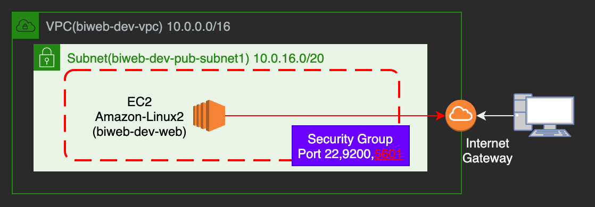


ブラウザで「http://[ip address]:5601/」にアクセスし、下の画面が表示がされればOK。

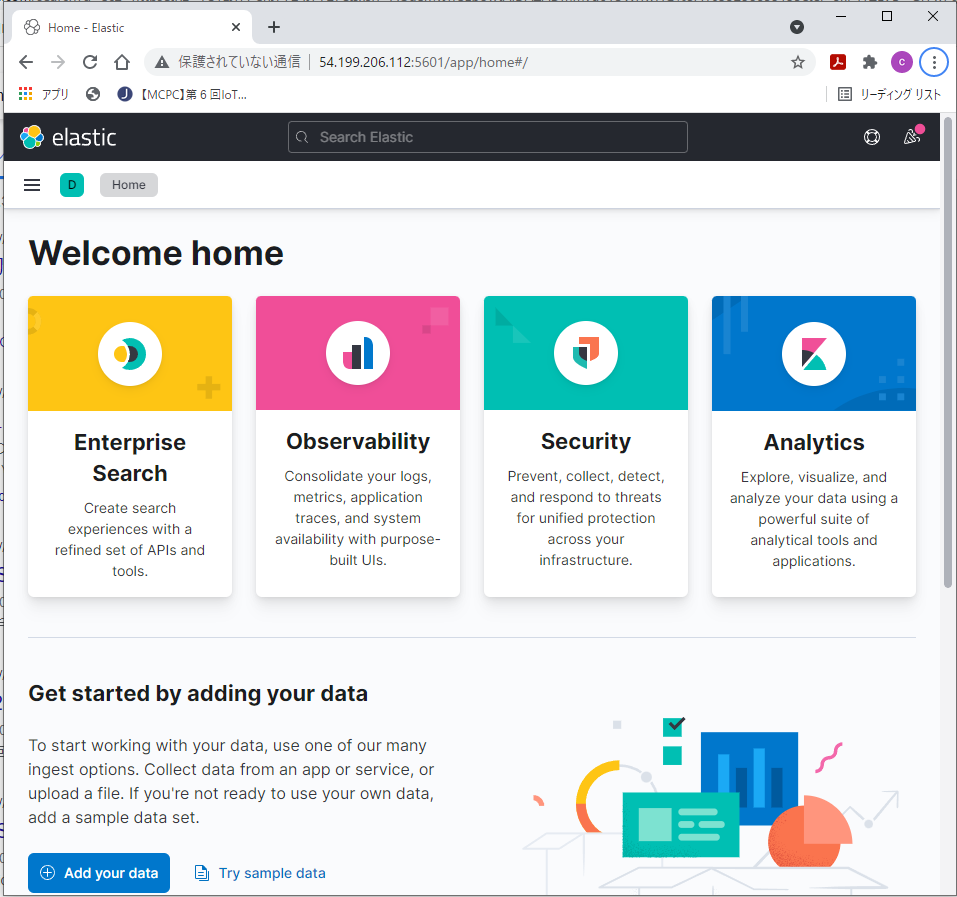

VisualStudioCodeのRestClientを使用して、ElasticSearchにIndexを定義する。

``` json 
PUT http://[host_ipaddress]:9200/iot_data/
Content-Type: application/json

{
    "mappings": {
        "properties": {
            "GetDateTime": {
                "type": "date",
                "format": "yyyy-MM-dd HH:mm:ss"
            },
            "Humidity": {
                "type": "float"
            },
            "Temperature": {
                "type": "float"
            }
        }
    }
}
```

## <span style="color:#DD8800; ">（RaspberryPi）AWS Lambda用のファンクションを作成する

作業用のフォルダを作成する。
``` bash
$ cd aws_lambda

$ mkdir airConditionESEntryFunc
$ cd airConditionESEntryFunc
```
直下に、pythonソースファイル [lambda_function.py](./aws_lambda/airConditionESEntryFunc/lambda_function.py) を作成する。  
※ソースコード中の "es_host","es_port","index" は、後ほどlambda上で環境変数として設定する。

このソースファイルに必要なライブラリ「requests」を、カレントディレクトリ上にインストールする。
``` bash
$ pip install requests -t ./
```

ソース＋ライブラリをlambdaへのアップロード用にzip圧縮する。
``` bash
# カレントディレクトリにlambda_function.pyと各種ライブラリがあることを確認
$ ls 
  bin                                 idna-3.3.dist-info
  certifi                             lambda_function.py
  certifi-2021.10.8.dist-info         requests
  charset_normalizer                  requests-2.26.0.dist-info
  charset_normalizer-2.0.7.dist-info  urllib3
  idna                                urllib3-1.26.7.dist-info

$ zip -r airConditionESEntryFunc.zip ./*
```

## <span style="color:#DD8800; ">（AWS）ElasticSerach登録用のLambda関数を作成する

以下の手順でlambda関数を作成する
- 「サービス」から「Lambda」を選択。
- 「関数」>「関数の作成」画面で、以下を指定して「関数の作成」をクリックする。
  - 関数名：「airConditionESEntryFunc」。名称自体は任意だが、前の手順でzip作成した際の、フォルダ名とあわせる
  - ランタイム：Python 3.9
  - アーキテクチャ：x86_64
  - アクセス権限>デフォルトの実行ロールの変更：
    - 「基本的な Lambda アクセス権限で新しいロールを作成」を選択
- 「コード」タブ開く
  - 画面右上の「アップロード元」に「.zip」ファイルを選択する。前の手順で作成したzipファイルを指定して、ソースをアップロードする。
- 「設定」タブ>「アクセス権限」を開く
  - 「実行ロール」に表示されたロール名のリンクをクリック（IAMのロール画面に遷移する）
  - 「ポリシーをアタッチします」をクリックして、次のポリシーを追加
    - `AmazonDynamoDBFullAccess`
    - `AWSLambdaVPCAccessExecutionRole`
- 「設定」タブ>「環境変数」で「編集」ボタンを押して以下の環境変数を追加
  - 「es_host」：EC2の<b><u>`プライベートIPv4アドレス`</u></b>を設定する。
  - 「es_port」：「9200」を設定する
  - 「index」：「iot_data」を設定する

次に、EC2のセキュリティグループに、Lambdaからのアクセス(Private内部からのアクセス)を許可するように設定する。

- 「サービス」から「EC2」を選択。
- 「インスタンス」から構築した「EC2」を選択。
- 画面下部で「セキュリティ」を選び、当該セキュリティグループのハイパーリンクから、内容を画面に表示する。
- 「インバウンドルール」タブで、「インバウンドのルールを編集」をクリックする。
- 以下のルールを追加
  - タイプ：カスタムTCP
  - ポート範囲：9200
  - ソース：（開いているセキュリティグループ自身）
  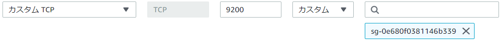


動作確認。
- 「コード」タブ>「テスト」で、「テスト」ボタンに以下の内容を登録して、テスト実行する。
``` json 
{
    "Records": [
        {
            "dynamodb": {
                "NewImage": {
                    "GetDateTime": {
                        "S": "2021-11-03 16:20:18"
                    },
                    "Temperature": {
                        "N": "20.5"
                    },
                    "Humidity": {
                        "N": "72.3"
                    }
                }
            }
        }
    ]
}
```
ブラウザから、KibanaのURLにアクセスし、Discover画面でデータが表示されれば疎通確認としてはOK。

正常に登録されることを確認できたら、以下の手順でDynamoDBテーブルの変更通知とつなげる。

- 「設定」タブ>「トリガー」で「トリガーを追加」ボタンをクリック
  - 「トリガーの設定」で「DynamoDB」を選択。
    - DynamoDBテーブル：「air-condition」
    - トリガーの有効化：チェック

<br>

トリガーが設定されると、1分に1回、ElasticSearchにデータが蓄積されるようになる。


## <span style="color:#DD8800; ">（RaspberryPi）二酸化炭素センサ、液晶ディスプレイを取り付ける

上記で温湿度センサーデータの連携は実現できた。これに加え、以下では二酸化炭素量の計測を行い、温湿度データとともにサーバへの送信、LINEへの通知、グラフ表示を行う。  

新たに、次のパーツを使用する。
- 液晶：Aideepen [SSD1306](https://www.amazon.co.jp/Aideepen-OLED%E3%83%87%E3%82%A3%E3%82%B9%E3%83%97%E3%83%AC%E3%82%A4IIC-OLED%E3%83%A2%E3%82%B8%E3%83%A5%E3%83%BC%E3%83%ABSSD1306-4%E3%83%94%E3%83%B3SPI%E3%82%A4%E3%83%B3%E3%82%BF%E3%83%BC%E3%83%95%E3%82%A7%E3%82%A4%E3%82%B9%E7%94%BB%E9%9D%A2-Arduino%E3%81%AB%E5%AF%BE%E5%BF%9C/dp/B099ZYRJWL/ref=sr_1_1_sspa?keywords=SSD1306&qid=1636469302&sr=8-1-spons&psc=1&spLa=ZW5jcnlwdGVkUXVhbGlmaWVyPUEzNUtHRFFOS0lIODFYJmVuY3J5cHRlZElkPUEwNzM0NzI2Mjk3UUJLRlUyM1lWNSZlbmNyeXB0ZWRBZElkPUEyNEdLQUE4WUFKRkhaJndpZGdldE5hbWU9c3BfYXRmJmFjdGlvbj1jbGlja1JlZGlyZWN0JmRvTm90TG9nQ2xpY2s9dHJ1ZQ==)
- 二酸化炭素センサ：KeyeStudio [CCS811](https://www.amazon.co.jp/KEYESTUDIO-CCS811-Arduino-%E3%82%A2%E3%83%AB%E3%83%89%E3%82%A5%E3%82%A4%E3%83%BC%E3%83%8E-%E3%82%A2%E3%83%AB%E3%83%87%E3%82%A3%E3%83%BC%E3%83%8E/dp/B086HCSM6N?ref_=ast_sto_dp)

RaspberryPiに、以下のように取付を行う。

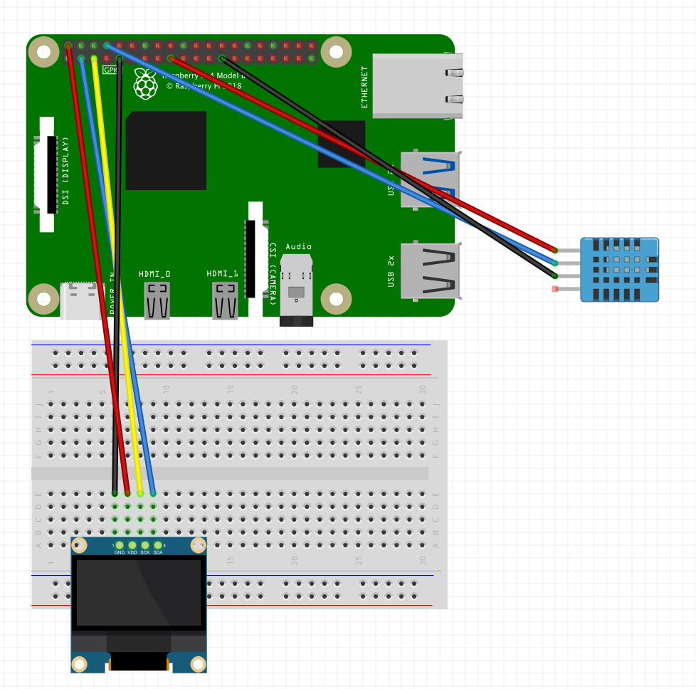

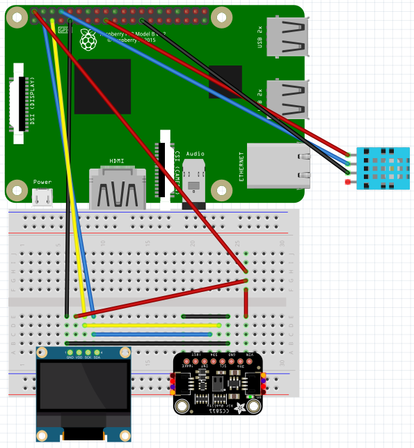

取付時のポイント
- 各機器のVIN、GNDは、RaspberryPiの5V、GNDと接続する（動作に4.5V以上が必要なため、電源は3.3Vではなく、5Vの方に接続すること）
- 各機器のSDA、SCLをそれぞれ、RaspberryPiのSDA(Pin#3)、SCL(Pin#5)と接続する。
- さらにCCS811のWAKEとGND同士を接続する。RSTとINTは今回使用しない。

今回のパーツは、I2Cというインターフェイスで接続を行う。機器を接続したら、RaspberryPiのターミナルから以下のコマンドを実行する。
```
$ i2cdetect -y 1
```
これにより、機器の接続状況が確認できる。  
以下のとおり表示されれば、接続OK。
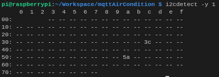  

表内の値は、それぞれ各機器の接続状態を示している。これらが表示されなければ、上のポイントを参考に、接続を再確認すること。
- アドレス3c … SSD1306(液晶)
- アドレス5a … CCS811(二酸化炭素センサ)

次に、I2Cの通信速度（ボーレート）を変更する。特にCCS811(二酸化炭素センサ)は、RaspberryPiのデフォルト速度100kHzでは動作せず、エラー「Remote I/O Error」が表示されてしまうことがある。

以下のコマンドを実行し、設定を編集する。
``` bash
$ sudo nano /boot/config.txt
```

編集画面が表示されたら、次の部分を編集して、保存する。
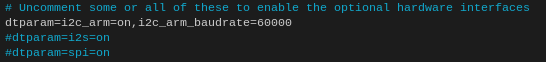
```
dtparam=i2c_arm=on,i2c_arm_baudrate=60000
```

編集が終わったら、一度RaspberryPiを再起動する。
``` bash
$ sudo reboot
```

再起動したら、必要なライブラリをPython環境にインストールする。
``` python
# SSD1306用ドライバ インストール
$ pip3 install adafruit-circuitpython-ssd1306 

# CCS811用ドライバ インストール
$ pip3 install adafruit-circuitpython-ccs811 

# board モジュール　インストール
$ pip3 install board

※この後の実行でModuleNotFoundError:No module named 'board'　と結果が出たら
以下コマンドを実行する。　これでダメな場合は2個目の強制インストールを実行する
$ pip3 install adafruit-blinka

$ python3 -m pip install --force-reinstall adafruit-blinka

# 液晶表示用のフォント インストール
$ sudo apt-get install fonts-noto 
```

[こちら](./aircond3.py)のソースを作業フォルダ直下に配置して、実行する  
※ソース上の定義部分「# Mqtt Define」の内容は、前述のデバイスデータエンドポイントや、証明書に置き換えてください。

```
$ python3 aircond3.py
```

以下のように表示されればOK。
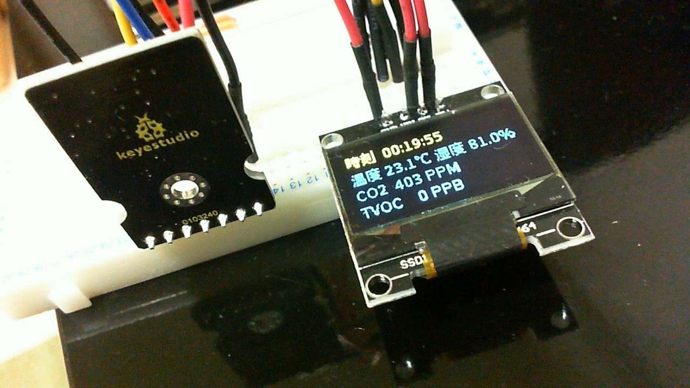

## <span style="color:#DD8800; ">（AWS）各種サービスを修正
以下の各種サービスに対して、二酸化炭素値を加え、Kibanaのグラフ出力、LINEの通知内容を編集していく（詳細は割愛する）
- IoT Core
- DynamoDB
- Lambda
- ElasticSearch
- Kibana

